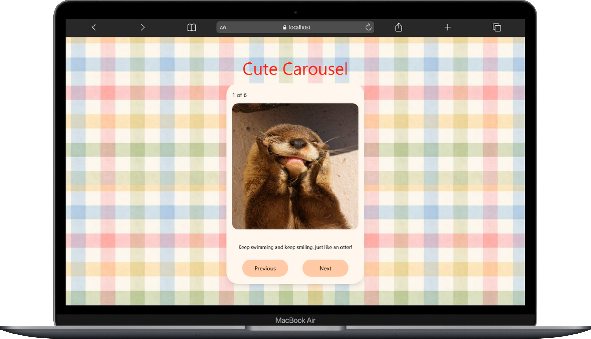
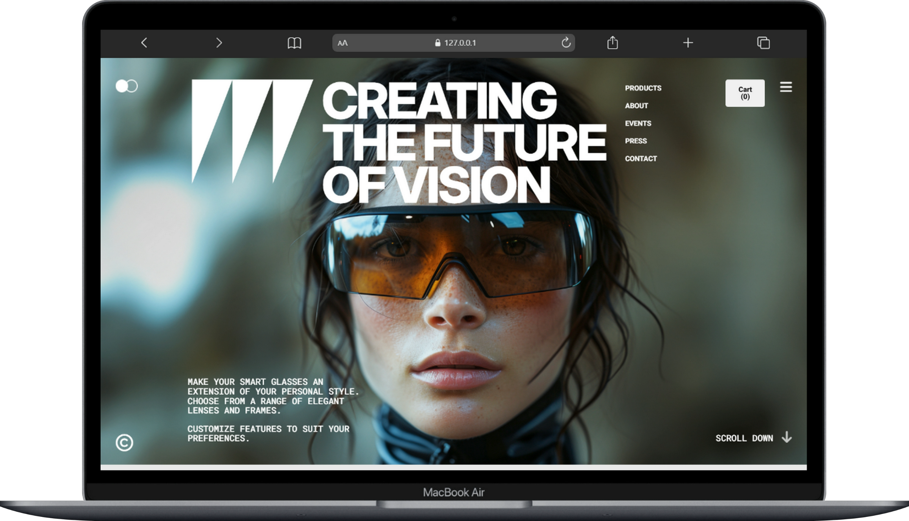
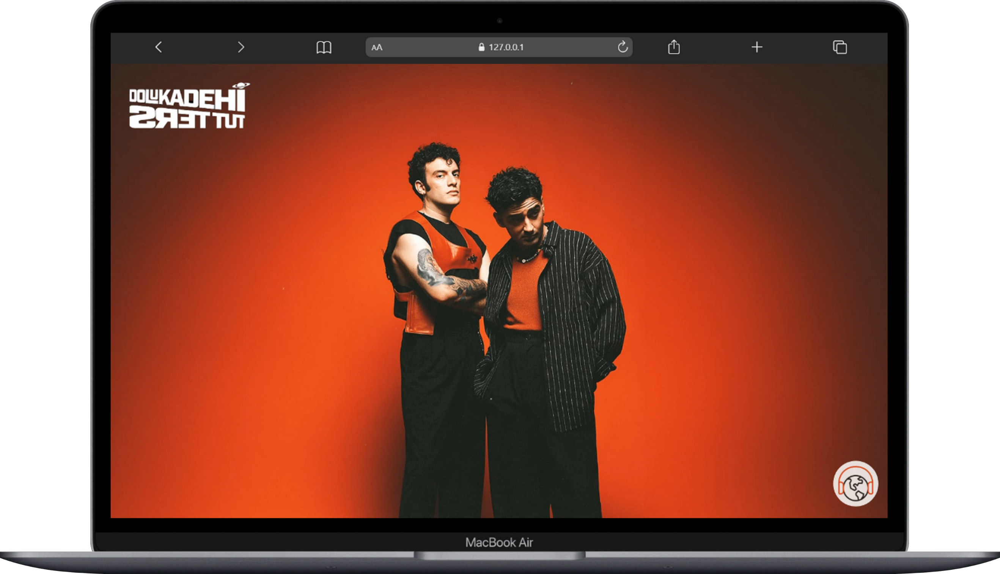
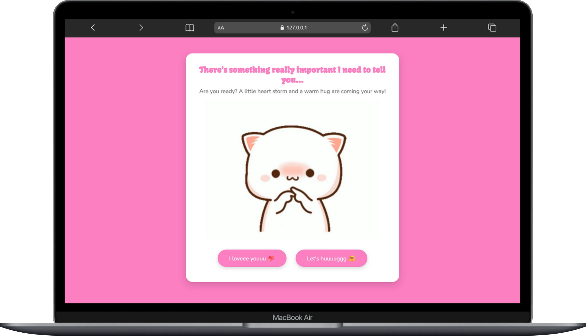
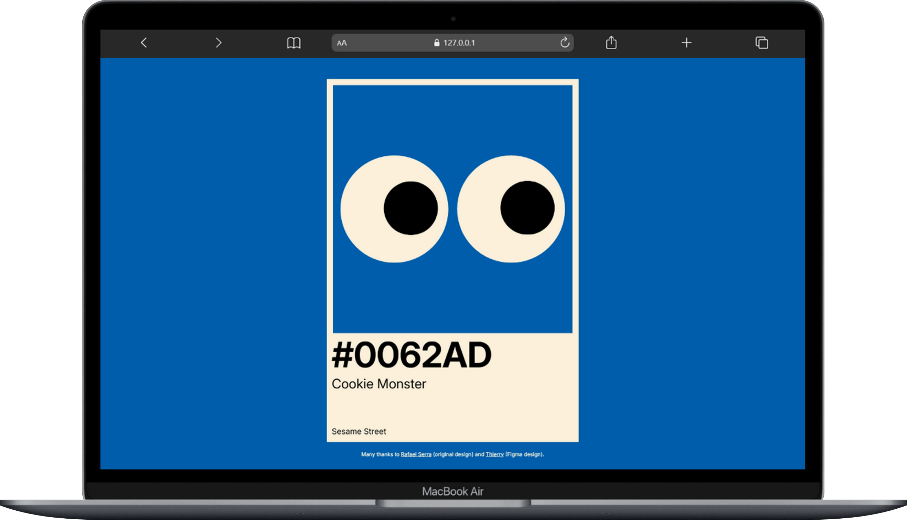
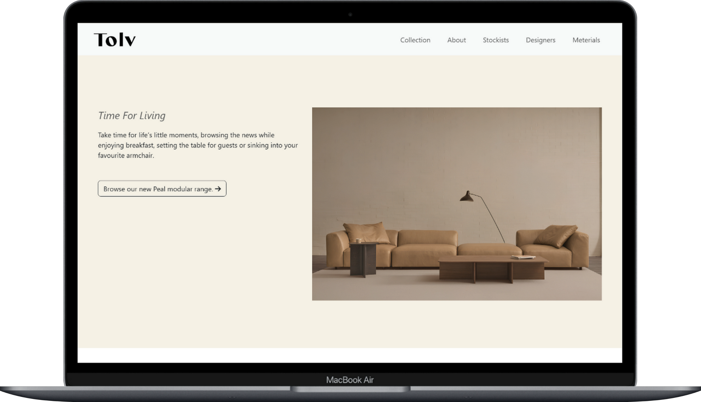
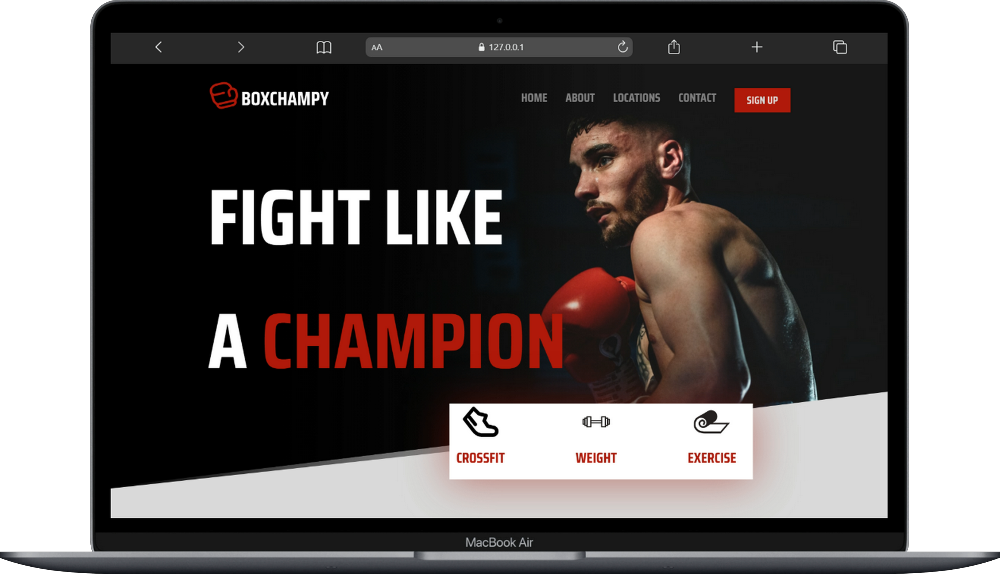
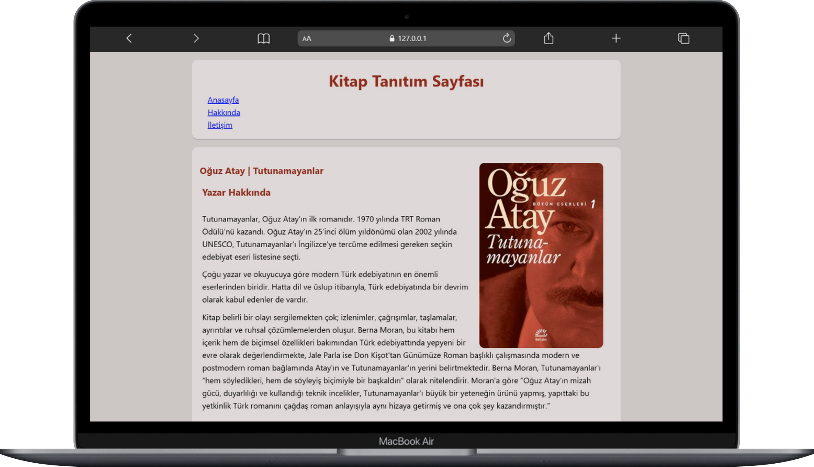

# Frontend Mini Projects

🇹🇷 Türkçe açıklama için: [readme_tr.md](./README_TR.md)

  

This repository contains small-scale projects I have created to reinforce what I have learned during my frontend development journey. Each project has been developed using core technologies such as HTML, CSS, and JavaScript. Some projects also utilize additional frameworks and libraries.

Some projects include Figma UI designs used for development or practice purposes. You can access them via the provided links.

---

## Project Showcase

  A curated collection of frontend practice projects.

 

<table>

<tr>

<td width="50%">
  
  <h3 align="center">Cute Carousel</h3>
  

    Cute carousel component built with React and Tailwind CSS. 
    React • Tailwind CSS • Responsive Design  
    <a href="https://cute-carousel-component.netlify.app/">Live Demo</a> •
    <a href="https://www.figma.com/community/file/1586123003360449417/nova-lens">View Design</a>
  

</td>

<td width="50%">
  
  <h3 align="center">Nova Lens</h3>
  

    Pixel-perfect smart glasses UI implementation. 
    HTML • CSS • JavaScript • Responsive Design  
    <a href="https://nova-lens.netlify.app/">Live Demo</a> •
    <a href="https://www.figma.com/community/file/1586123003360449417/nova-lens">View Design</a>
  

</td>

</tr>

<tr>

<td width="50%">
  
  <h3 align="center">Music Band Showcase</h3>
  

    Visual-focused promo site with Spotify integration. 
    HTML • CSS • JavaScript • Spotify Embed  
    <a href="https://tugce.42web.io">Live Demo</a>
  

</td>

<td width="50%">
  
  <h3 align="center">Purrrfect Love Card</h3>
  

    Interactive love card with animations. 
    HTML • CSS Animations • JavaScript  
    <a href="https://purrrfectlovecard.netlify.app/">Live Demo</a>
  

</td>

</tr>

<tr>

<td width="50%">
  
  <h3 align="center">Cookie Monster Card</h3>
  

    Interactive eye-following card effect. 
    HTML • CSS • JavaScript • DOM Manipulation  
    <a href="https://cookieemonster.netlify.app/">Live Demo</a>
  

</td>

<td width="50%">
  
  <h3 align="center">Bootstrap Furniture Website</h3>
  

    Fully built with Bootstrap. 
    HTML • Bootstrap 5 • Responsive Grid  
    <a href="https://my-site.is-best.net">Live Demo</a>
  

</td>

</tr>

<tr>

<td width="50%">
  
  <h3 align="center">Boxchampy Website</h3>
  

    UI implementation from Figma. 
    HTML • CSS • Flexbox • Grid  
    <a href="https://www.figma.com/community/file/1519362285643212664/boxchampy">View Design</a>
  

</td>

<td width="50%">
  
  <h3 align="center">Book Showcase Page</h3>
  

    A simple book review page. 
    HTML • CSS
  

</td>

</tr>

</table>

> This table will be updated as new projects are added.

---

## Purpose

This repository has been created to document my learning process, improve my frontend skills, and showcase them in my portfolio. Not every project may be production-ready, but they provide a solid starting point.

- Apply HTML, CSS, and JavaScript knowledge in practice
- Experiment with different UI/UX structures
- Develop coding habits
- Practice Git and GitHub
- Learn and practice Figma
- Explore modern frontend tools and frameworks

---

## Contributions

These projects are for personal development, but I am always open to pull requests and issues.

I welcome your feedback!

---

> This repository is actively maintained. It will be updated as new projects are added.