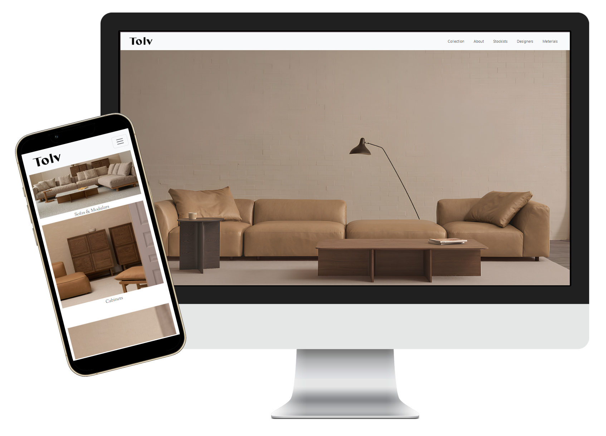

# Furniture Website Clone (Bootstrap)

This project is a UI clone of the [tolv.dk](https://tolv.dk) website.  
The goal is to rebuild a real user interface using Bootstrap to practice responsive layouts, component usage, and the grid system.

## 🔗 Demo

Check out the live demo here:

👉 [Live Demo](https://my-site.is-best.net)

---

## 🔧 Technologies Used

- **HTML5** – Page structure  
- **CSS3** – Styling (Bootstrap + custom CSS when needed)  
- **Bootstrap 5** – Responsive grid system, ready-made components, and overall layout  

## 🎯 Purpose

- Understand the structure by examining Bootstrap templates  
- Practice customization based on existing designs  
- Reinforce HTML/CSS and framework knowledge through practice  
- Gain experience with ready-made layouts that can serve as a foundation for my own projects  

## 📘 Key Learnings

- Applying the Bootstrap grid system  
- Designing pages using pre-built components  
- Limitations of inline styles  

## 🚧 Development Plan

- Reorganize with a CSS file  
- Refactor according to clean code principles  
- **Scroll Animations**: Make sections appear with animation as the page scrolls (e.g., using AOS or IntersectionObserver)
