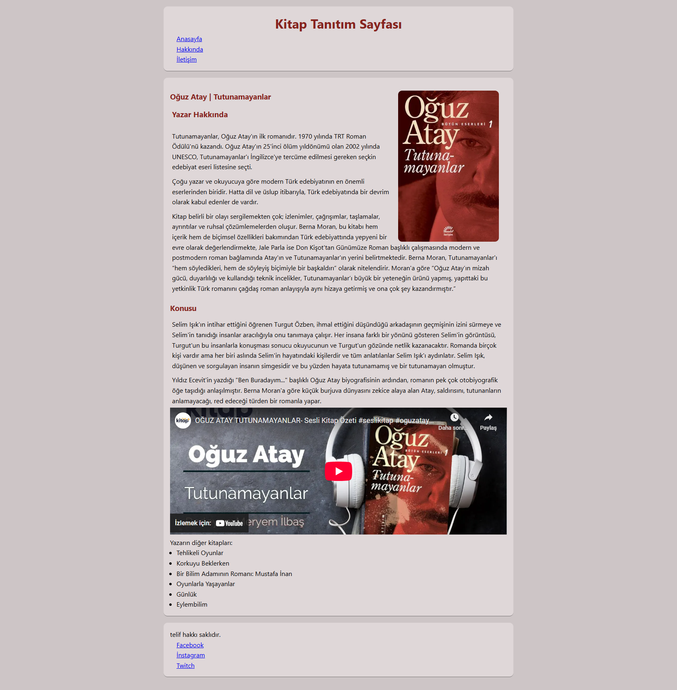

# Kitap Tanıtım Sayfası

Bu proje, seçilen bir kitabın tanıtımını yapan basit ve şık bir frontend sayfasıdır. Sayfa, kitap kapağı görseli, başlığı, yazarı ve açıklama gibi temel bilgileri içerir. Görsel odaklı ve sade bir tasarım hedeflenmiştir.

## 📚 Amaç

- HTML ve CSS ile temel bir içerik sayfası oluşturmak
- Tipografi ve yerleşim üzerine pratik yapmak
- Görsel ağırlıklı tanıtım sayfası hazırlamak

## 🛠️ Kullanılan Teknolojiler

- HTML5
- CSS3

## 📸 Ekran Görüntüsü



## 🔧 Kurulum ve Çalıştırma

1. Bu klasörü bilgisayarına klonla:
   ```bash
   git clone https://github.com/kullanici-adin/frontend-mini-projeler.git
   cd frontend-mini-projeler/kitap-tanitim-sayfasi
