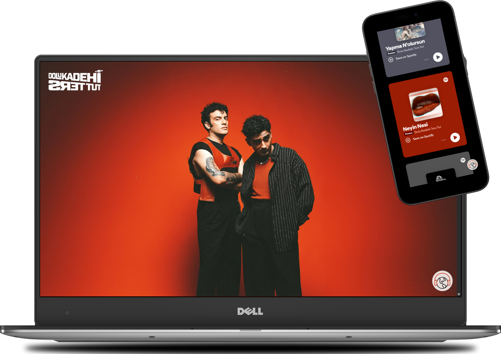

# 🎶 Müzik Grubu Tanıtım Sitesi

Bu proje, hem görsel hem işitsel içeriklerle zenginleştirilmiş, tamamen HTML ve CSS ile hazırlanmış bir **müzik grubu tanıtım sayfasıdır**. Grubun tarzını, üyelerini ve albümlerini tanıtmakla kalmaz; aynı zamanda kullanıcıya müzik dinleme deneyimi de sunar. Proje süresince tipografi, yerleşim, görsel uyum ve ses entegresi gibi birçok frontend becerisi üzerinde çalıştım.

---

## 🎯 Projenin Amacı

Bu projeyi yapmaktaki amacım:
- Görsel ve içerik uyumu olan etkileyici bir tanıtım sitesi tasarlamak
- Tipografi ve layout konusunda pratik yapmak
- Gerçek hayatta karşılaşılabilecek bir projeyi simüle etmek
- HTML ve CSS ile sınırlı imkânlarla etkileyici bir sonuç ortaya koymak
- Dahili **Spotify bağlantısı** ve **müzik oynatıcı** gibi detaylarla deneyimi zenginleştirmek

---

## 🖼️ Ekran Görüntüsü

---
## 🔗 Demo

Projeyi canlı olarak incelemek için:

👉 [Canlı Demo](https://tugce.42web.io)
## 🎧 Site İçeriği

- 🎵 **Grup adı ve logo**
- 💽 **Albüm kapakları** ve dinleme deneyimi
- 🔊 **Gömülü Spotify bağlantısı** (dinlenebilir içerik)
- 🎼 **Ses oynatıcı** ile grup müziklerinden örnekler
- 🎨 **Tipografi ve yerleşim odaklı tasarım**
- 🌈 **Mini geçiş efektleri**

---

## 🔧 Kullanılan Teknolojiler

| Teknoloji | Açıklama                      |
|-----------|-------------------------------|
| HTML5     | Sayfa yapısı ve içerik iskeleti |
| CSS3      | Görsel tasarım ve animasyonlar |
| Spotify Embed | Müzik entegrasyonu         |

-----

> 🛠️ Bu repo aktif olarak geliştirilmektedir. 
