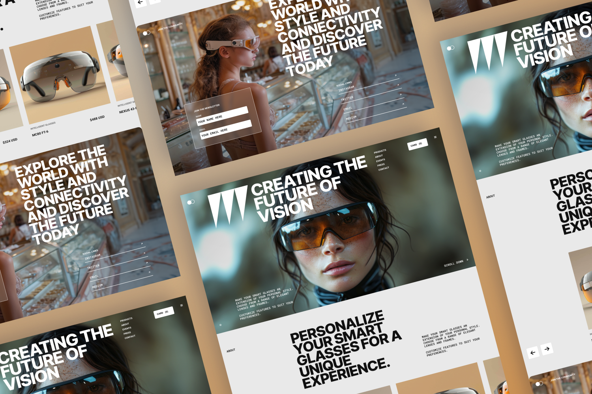

# Nova Lens – Smart Glasses UI Implementation
🇹🇷 Türkçe açıklama için: [readme_tr.md](./readme_tr.md)

Nova Lens is a **frontend-focused UI implementation project** built to practice translating a high-fidelity design into clean, responsive, and maintainable code.  
The primary goal of this project was **design-to-code accuracy**, not visual redesign.

[](https://app.netlify.com/projects/nova-lens/deploys)

---

## Project Links

- **Live Demo:** https://nova-lens.netlify.app/
- **Figma Design (Recreated):** https://www.figma.com/community/file/1586123003360449417/nova-lens
- **Design Tutorial:** https://youtu.be/clSHs94hNNc
- **Assets Source:** Flux Academy (icons & images)

---

## Project Purpose

This project focuses on the **frontend implementation of a smart glasses UI**.

The UI was **recreated in Figma by following a Flux Academy design tutorial**, using provided visual assets such as icons and images.  
After recreating the design in Figma, the entire interface was **implemented independently using HTML, CSS, and Vanilla JavaScript**.

No visual redesign decisions were made.  
The challenge was centered on **layout precision, responsiveness, and interaction logic**.

---

## What I Practiced & Learned

- **Design-to-Code Workflow**  
  Rebuilding a UI by reading a Figma file and converting spacing, typography, and layout into code.

- **Responsive Layout Strategy**  
  Using `clamp()` and flexible units to achieve fluid layouts with minimal media queries.

- **CSS Architecture**  
  Applying BEM methodology and CSS custom properties for scalable and maintainable styles.

- **Vanilla JavaScript UI Logic**  
  Implementing a custom product slider and click-based reordering behavior without external libraries.

- **Interaction & Motion**  
  Adding scroll reveal animations and hover effects to enhance user experience.

---

## Tech Stack

| Technology | Description |
|----------|-------------|
| HTML5 | Semantic structure |
| CSS3 | Flexbox, Grid, Custom Properties, `clamp()` |
| JavaScript (ES6+) | DOM manipulation & UI logic |
| Netlify | Hosting & continuous deployment |

---

## Features

- Infinite-style product slider
- Click-to-focus product cards
- Scroll-based reveal animations
- Fully responsive layout (mobile → desktop)
- Clean and maintainable CSS structure

---

## Preview



---

## Credits

- Design tutorial & assets: **Flux Academy**
- Figma recreation & frontend implementation: **Tuğçe Karakuş**

---

## Local Setup

```bash
git clone https://github.com/tugcekarakuss/nova-lens.git
cd nova-lens
