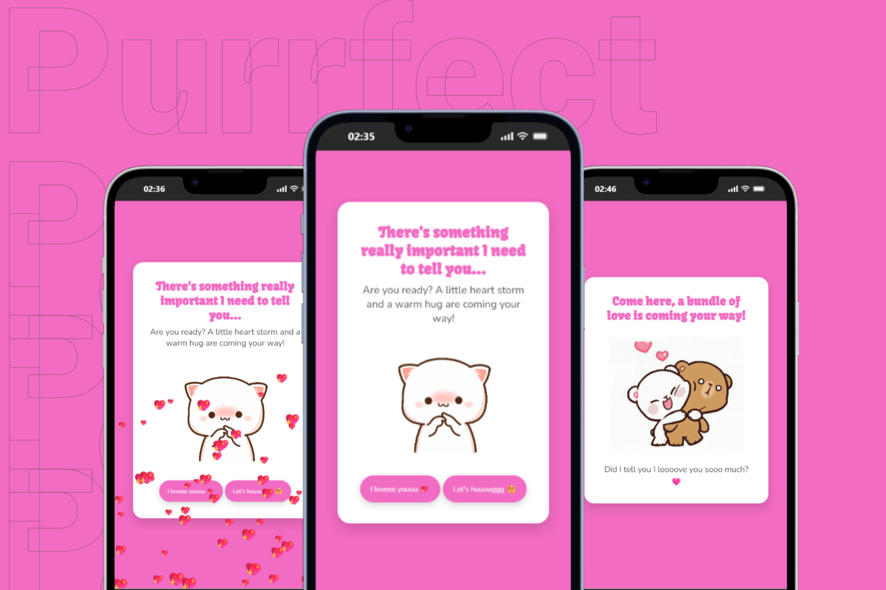
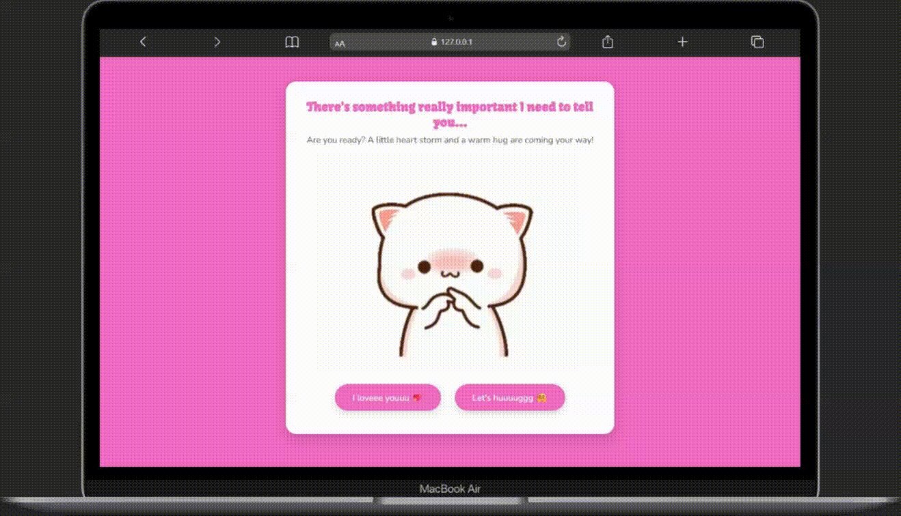

# Cute Card Project

🇹🇷 Türkçe açıklama için: [README_TR.md](./readme_TR.md)

This project is a fun and **cute card application**.  
It was first designed in **Figma**, then developed using HTML, CSS, and JavaScript.  
The goal is to create a delightful surprise experience with animations, GIFs, and lots of hearts. 💕  

---

## ✨ Features
- 🎨 **From Figma design to code** implementation  
- 🐱 **Adorable GIFs** for a playful touch  
- 💖 Heart rain animation when clicking the button  
- 🤗 “Let's Hug” button that redirects to a second page  
- 📱 **Responsive design** (mobile and desktop)  

---

## ❤️ Inspiration & Design
This project was made **just for fun and love**.  
It was created as a sweet surprise for a friend.  

- **Figma Design:** [View on Figma](https://www.figma.com/@tugcekarakus)

---

## 🚀 Technologies Used
- **HTML5** → structure  
- **CSS3** → styling & layout  
- **JavaScript** → confetti/heart animation & button interactions `

  > *Note: The JavaScript code was sourced externally and not written by the author.*  
- **Google Fonts** → *Kavoon* and *Nunito* fonts  

---

## 📸 Screenshots
  

---


## 🎥 Project Demo
- **Live Demo:** [Click here to try it!](https://purrrfectlovecard.netlify.app/)  
- **Preview Video:**  
    

---

## 📂 Project Structure
```
/img
├── ask1.gif
├── hug.gif
└── ico.png
index.html
hug.html
style.css

```