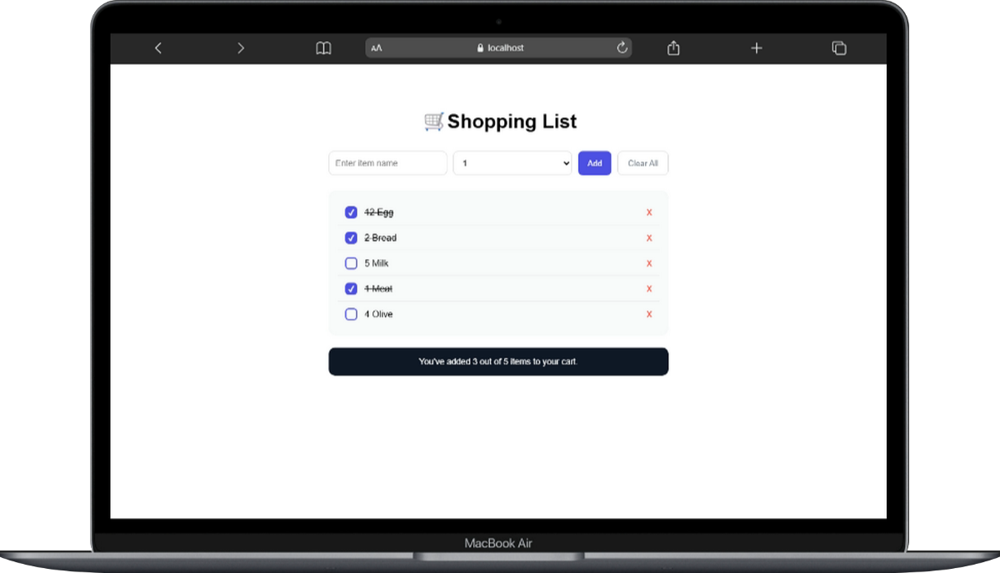

# Smart Shopping List – React Alışveriş Listesi Uygulaması

 English version: [README.md](./README.md)

Smart Shopping List, bileşen tabanlı mimariyi, state yönetimini ve kullanıcı etkileşimlerini pratik etmek amacıyla geliştirilen **React tabanlı bir frontend projesidir**.

Bu projenin temel amacı, React'in temel prensiplerini ve veri akışını daha iyi anlamaya yardımcı olacak **temiz, etkileşimli ve sürdürülebilir bir alışveriş listesi uygulaması** geliştirmektir.




---

## Proje Linkleri

* **Canlı Demo:** https://shopping-list-component.netlify.app/
* **English README:** [README.md](./README.md)

---

## Projenin Amacı

Bu proje, bir **alışveriş listesi yönetim arayüzünün geliştirilmesine** odaklanmaktadır.

Kullanıcılar ürün ekleyebilir, ürünleri tamamlandı olarak işaretleyebilir, tek tek silebilir veya tüm alışveriş listesini tek tıklamayla temizleyebilir.

Projenin temel odağı; **state yönetimi, componentler arası veri aktarımı ve React Hook'ları kullanılarak dinamik kullanıcı arayüzleri geliştirmektir**.

---

## Bu Projede Neler Pratik Ettim?

* **React Bileşen Mimarisi**
  Uygulamayı yeniden kullanılabilir ve sürdürülebilir bileşenlere ayırma.

* **Hook Kullanarak State Yönetimi**
  `useState` ile alışveriş listesini yönetme ve arayüzü reaktif olarak güncelleme.

* **Props ve Veri Akışı**
  Parent ve child componentler arasında veri ve fonksiyon aktarımı gerçekleştirme.

* **Dizi State Manipülasyonu**
  Immutable yapı kullanarak eleman ekleme, silme ve güncelleme işlemleri yapma.

* **Koşullu Render İşlemleri**
  Liste özeti ve kullanıcı geri bildirimlerini dinamik olarak gösterme.

---

## Kullanılan Teknolojiler

| Teknoloji         | Açıklama                                     |
| ----------------- | -------------------------------------------- |
| React             | Bileşen tabanlı kullanıcı arayüzü geliştirme |
| JavaScript (ES6+) | Uygulama mantığı                             |
| CSS3              | Stil ve responsive tasarım                   |
| Vite              | Geliştirme ortamı ve build aracı             |

---

## Özellikler

* Yeni alışveriş ürünü ekleme
* Ürünleri tamamlandı olarak işaretleme
* Tekil ürün silme
* Tüm alışveriş listesini temizleme
* Gerçek zamanlı alışveriş özeti güncellemesi
* Responsive ve sade kullanıcı arayüzü

---

## Proje Yapısı

```text
src
├── components
│   ├── Header.jsx
│   ├── Form.jsx
│   ├── List.jsx
│   └── Summary.jsx
├── data.js
├── App.jsx
└── main.jsx
```

---

## Yerel Kurulum

```bash
git clone https://github.com/yourusername/shopping-list-app.git
cd shopping-list-app
npm install
npm run dev
```

---

## Katkılar

* Proje fikri ve rehberlik: **Sadık Turan**
* Frontend geliştirme ve uygulama: **Tuğçe Karakuş**
